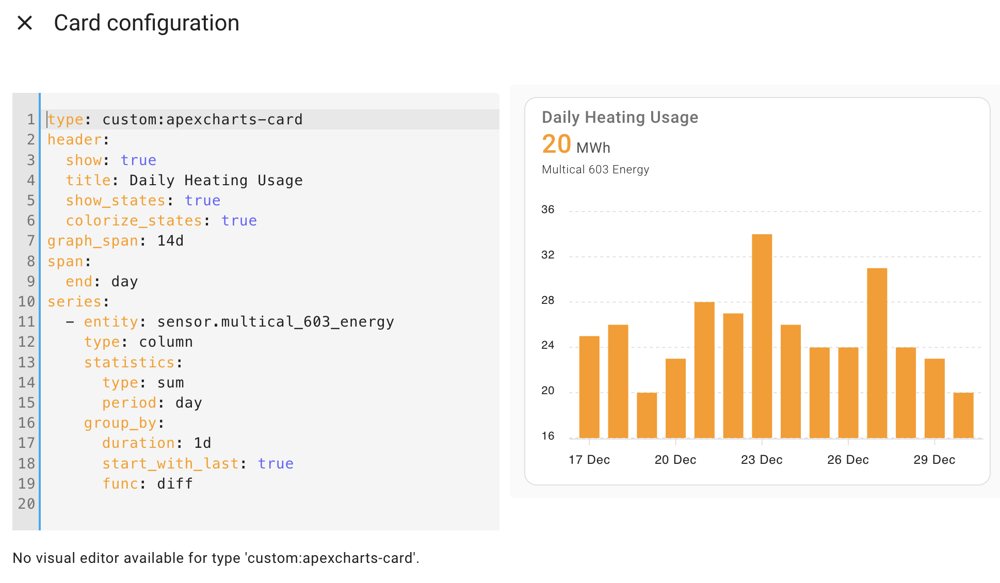

# Home Assistance 



1. remember to install apexcharts-card using [HACS](https://hacs.xyz/)
2. in a Dashboard add a manual entry and copy the information from graph-energy.yaml (or see below) into it. 

Code
```yaml
type: custom:apexcharts-card
header:
  show: true
  title: Daily Heating Usage
  show_states: true
  colorize_states: true
graph_span: 14d
span:
  end: day
series:
  - entity: sensor.multical_603_energy
    type: column
    statistics:
      type: sum
      period: day
    group_by:
      duration: 1d
      start_with_last: true
      func: diff
```